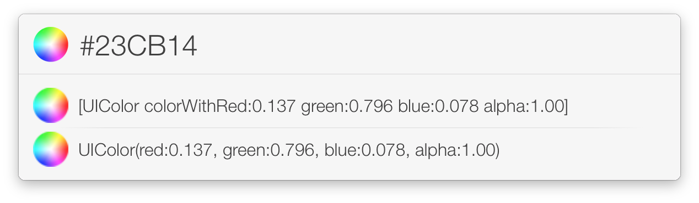
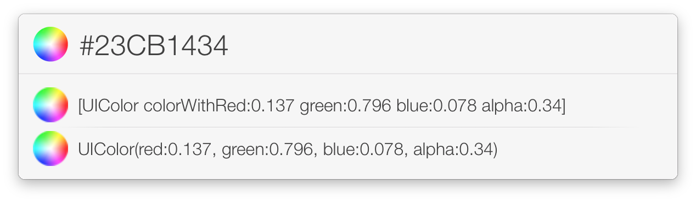

#UIColorConverter

[LaunchBar 6](http://www.obdev.at/products/launchbar/index.html) action to convert a HEX Color string into a UIColor String.

Enter a HEX color string and the alpha value, select your preferred output and holding down the ⌘–key while pressing return to paste the result in your editor.

##Installation

* Just double click the **UIColor Converter.lbaction** file
* Click the "Install" button and you are ready to go

All your Launchbar 6 actions are stored in ~/Library/Application Support/Launchbar/actions

